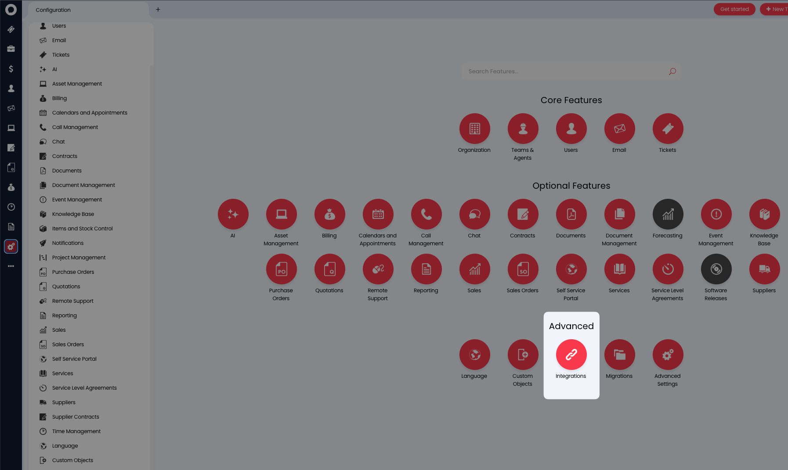
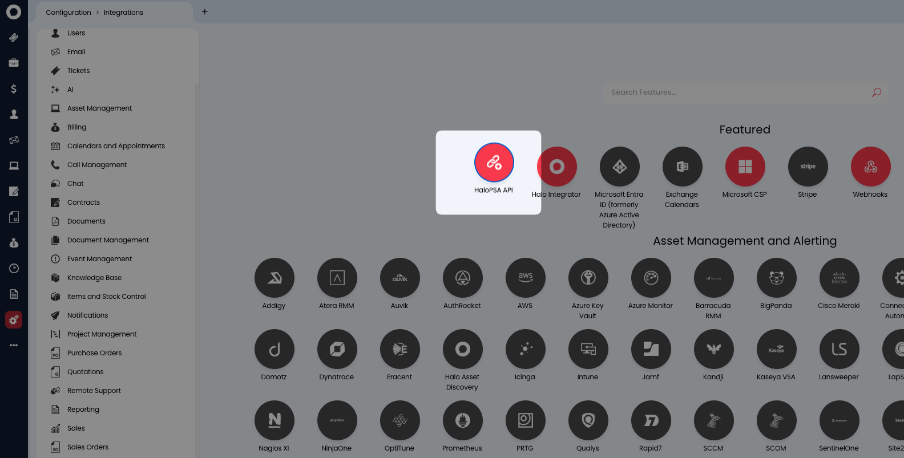

# HaloPSA Integration - REST API Setup Guide

This guide explains how to connect your HaloPSA instance to the Warranty Watcher application using the REST API method for automated warranty tracking and device management.

## Step 1: Create API Application in HaloPSA

### 1.1 Navigate to API Configuration

1. Log into your HaloPSA instance
   - **Note your instance URL**, it should something like `yourcompany.halopsa.com`
2. Go to **Configuration** → **Integrations** → **HaloPSA API**

### 1.2 Create New Application

1. Click **View Applications**
2. Select **New** in the top right corner
3. Configure the application with these settings:
   - **Application Name**: `Warranty Watcher`
   - **Authentication Method**: `Client ID and Secret (Services)`
   - **Login Type**: `Agent`
   - **Select Agent**: Choose an agent account for API authentication

### 1.3 Generate Credentials

1. **Note the Client ID** displayed after saving
2. **Generate Client Secret**: Click to generate and immediately copy it (viewable only once)
3. **Save** the application

### 1.4 Set Permissions

In the **Permissions** tab, grant the following permissions:
- `read:asset` - Read asset information
- `edit:asset` - Update asset warranty information

## Step 2: Configure Warranty Watcher

### 2.1 Access Configuration

1. Open Warranty Watcher application
2. Navigate to the configuration page
3. Scroll down. Look for the **HaloPSA Integration** section

### 2.2 Enter Connection Details

Fill in the following fields:

| Field | Description | Example |
|-------|-------------|---------|
| **HaloPSA URL** | Your HaloPSA instance URL (check your browser) | `yourcompany.halopsa.com` |
| **Client ID** | From the API application you created | `12345678-abcd-1234-efgh-123456789012` |
| **Client Secret** | Generated secret (copy from Step 1.3) | `your-secret-key-here` |
